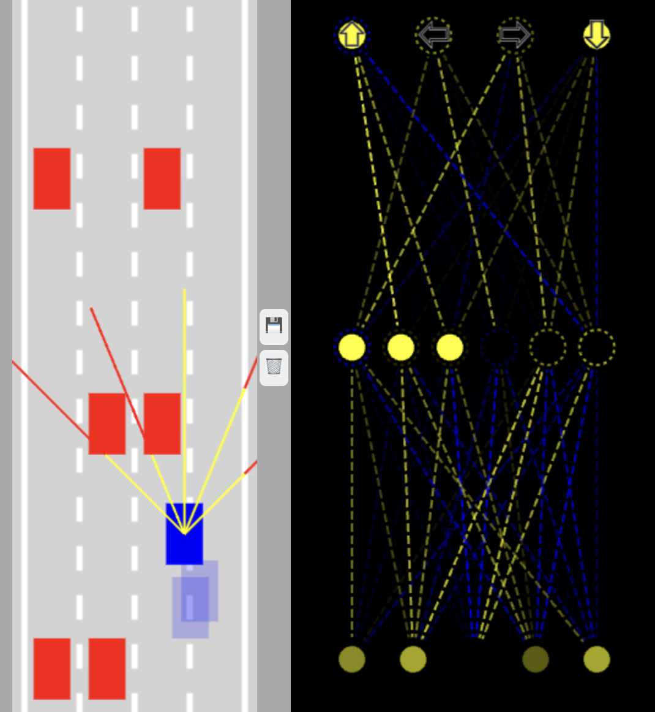

# AISelfDrivingCar
Barebones (no library) self improving NN for car collision avoidance. Each vehicle has 5 sensors that measure distance from objects. A distance vector is given for the NN to learn and 4 possible commands / instructions were created for controlling the vehicle.

It is possible to control the vehicle to:
1. Drive up (accelarate)
2. Slow down
3. Turn left
4. Turn right

The network will control how this intructions are given.
The initial (and available) model spawns 800 simultaneous cars on the center lane (half canvas width). A randomness factor is included in spawning each vehicle and a mutation rate of 10% is set on the configurations. Adjusting this value might help getting into better solutions fast, but once local minimums are reached we should tweak this. Feel free to fork the project and try some values by yourself.

Project done in an afternoon so the code is no the best looking out there.
Currently the NN is being stored on browsers local storage. Should you want to force store a best brain, hit the 💾 button. Should you want to remove latest saved brain, just revert by hitting the trash icon 🗑️. Brain history is saved in stack.

---
## UI Explanation

On the left canvas you can see the road (background) with 4 lanes (separated by dottet line). Training set cars (blue) will spawn in the middle of the canvas. The sensors are displayed for the vehicle with the best fitness score (further distance). Red cars are obstacles, this is the ones we want to avoid. They start with a deterministic spawn location (first couple of rows) and then get randomized.

On the right you can see the current inputs of the NN for the shown brain / sensors. The five inputs in the bottom trigger accordingly to th weights of the distance from the vehicle to the obstacle, a middle layer or features was selected arbitrarily and a final one (top one) decides what arrow keys should be pressed.

Once you've found a best brain, save it and refresh the page. All the newly generated vehicles will automatically inherit the previous best brain (1 will preserve the wheights, all the other 799 suffer a 10% mutation).

__Have fun__
